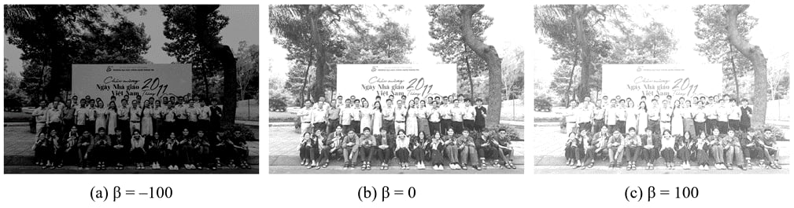

# RGB to Grayscale Conversion (Verilog & Python)

This repository contains a complete workflow for converting RGB images to Grayscale images with an adjustable brightness parameter (β).  
The project includes both **Python-based preprocessing and verification** and a **Verilog hardware-oriented implementation**, making it suitable for digital design and HDL-based image processing studies.

---

## 1. Project Overview

The RGB-to-Grayscale conversion is performed using the standard luminance formula:

\[
Y = 0.299R + 0.587G + 0.114B
\]

To make the design hardware-friendly, the floating-point computation is approximated using integer arithmetic and a right-shift operation (`>> 8`).  
An additional **brightness control parameter β** is applied after grayscale conversion to increase or decrease image brightness. The output is saturated to the valid range \([0, 255]\) to avoid overflow and underflow.

The overall workflow is:
1. Convert an RGB image (`.bmp`) into hexadecimal pixel data (`.hex`) using Python.
2. Process RGB pixels in Verilog to generate grayscale values with brightness adjustment.
3. Convert the resulting grayscale `.hex` file back into a `.bmp` image using Python for visualization and verification.
4. Compare results across different brightness parameters β.

---

## 2. Folder Structure
```
├── python/                         # Python preprocessing and postprocessing scripts
│   ├── 1_bmp_to_hex.py             # Convert RGB BMP to RGB hex (1 pixel = 3 lines)
│   ├── 2_rgb_to_greyscale.py       # Python grayscale + brightness reference
│   └── 3_hex_to_bmp.py             # Convert grayscale hex back to BMP
│
├── rtl/                            # Verilog implementation
│   ├── parameter.v                 # Global parameters (PIXEL_WIDTH, BRIGHTNESS, etc.)
│   ├── rgb_to_greyscale.v          # RGB to grayscale conversion module
│   ├── brightness.v                # Brightness adjustment with saturation
│   ├── rgb_to_greyscale_top.v      # Top module combining grayscale + brightness
│   └── tb_rgb_to_greyscale_top.v   # Testbench for full image processing
│
├── images/                         # Example input/output images and hex data
│   ├── input.bmp                   # Original RGB input image
│   ├── input.hex                   # RGB hex data (R, G, B per pixel)
│   ├── output.bmp                  # Grayscale output image
│   ├── output.hex                  # Grayscale hex data
│   └── verilog.hex                 # Grayscale hex generated by Verilog
│
├── output.png                      # Visualization of brightness comparison
└── README.md
```

---

## 3. Example Results

### Figure 1. RGB to Grayscale conversion with different brightness parameters β

The figure below shows an example input image and the corresponding grayscale outputs generated with different brightness values:

- **β = -100**: Darker grayscale image  
- **β = 0**: Normal grayscale image  
- **β = +100**: Brighter grayscale image  

These results are consistent between the Python reference implementation and the Verilog simulation, confirming the correctness of the hardware design.



---
